# Screenshot history

Generated from [`manifest.json`](manifest.json) by `scripts/capture-screenshots.mjs --index`.
Do not hand-edit — edit the manifest and regenerate.

Committed to git on purpose so a reviewer can pull the repo and see each phase
without running anything. It gets removed at the final cleanup pass.

Convention: `phase-N/NN-slug.png`, numbered in review order.

## Phase 0 — the rejected showcase city (baseline)

*commit `de0b27f` · captured 2026-09-18 · Hand-authored fictional geography, kept as the 'before' of the rescue*

The substrate Phase 1 replaced: invented districts (NORTHWORKS, RIVERSIDE, GRAND TOUR CENTRAL, MARKET DISTRICT, WEST PARK, MOUNT CIRCLE), giant rectangle buildings, schematic grid, authored bridge geometry. The product shell in these shots is the one Phase 3 will rework.

| # | shot | view | what it shows |
| - | ---- | ---- | ------------- |
| 01 | [metro](phase-0-baseline/01-metro.png) | Metro scale, city zoom | Invented district names and a schematic grid; every building is a flat rectangle, the river is a uniform blue strip, and the highway is a straight diagonal with idealized ramps. |
| 02 | [downtown](phase-0-baseline/02-downtown.png) | Downtown, mid zoom | Fictional block structure: regular grid logic, oversized building masses, no real street names. |
| 03 | [close](phase-0-baseline/03-close.png) | Street zoom | The close-zoom substrate that Phase 2 had to make physical: buildings with no footprint detail, signals as plain colored dots, vehicles as bare glyphs. |

### 01 · metro

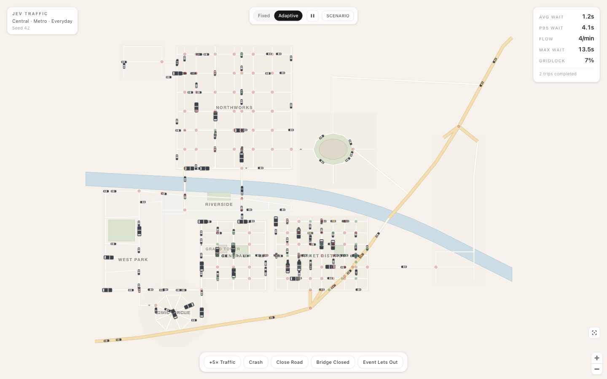

Metro scale, city zoom — Invented district names and a schematic grid; every building is a flat rectangle, the river is a uniform blue strip, and the highway is a straight diagonal with idealized ramps.

### 02 · downtown

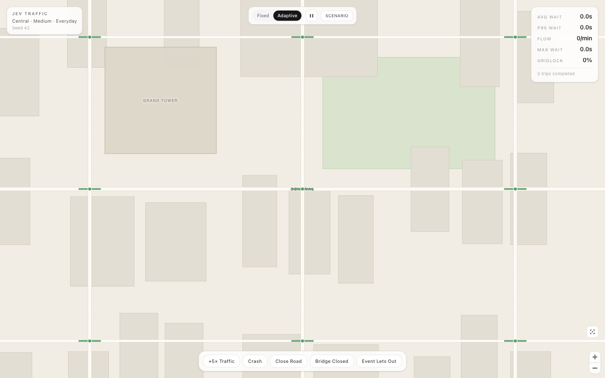

Downtown, mid zoom — Fictional block structure: regular grid logic, oversized building masses, no real street names.

### 03 · close

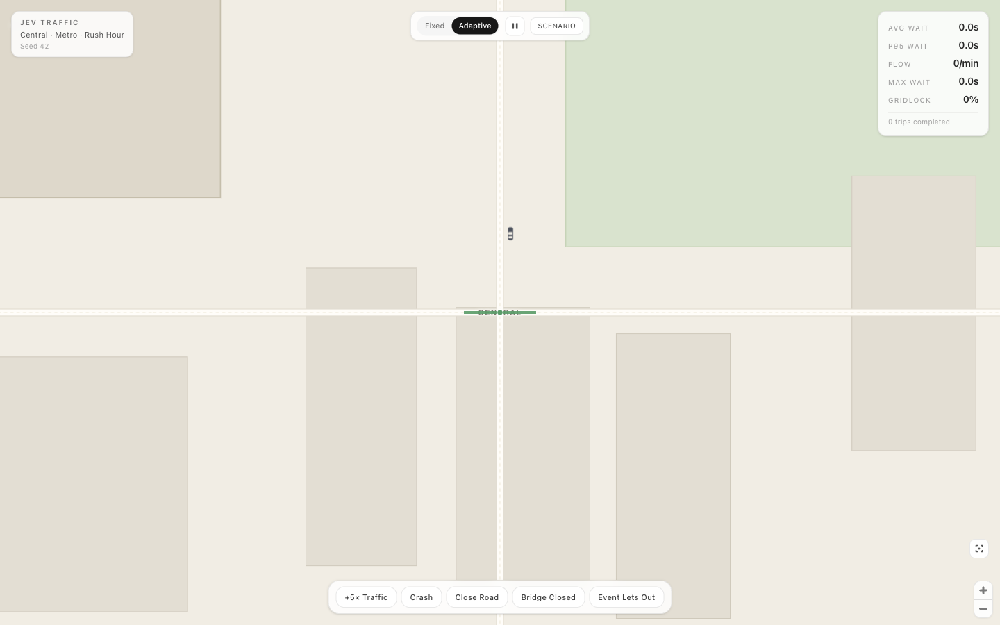

Street zoom — The close-zoom substrate that Phase 2 had to make physical: buildings with no footprint detail, signals as plain colored dots, vehicles as bare glyphs.

## Phase 1 — real Chicago geography and simulation semantics

*commit `2dd0637` · captured 2026-09-18 · One-time OSM preprocessing pipeline; frozen artifacts committed; procedural generator untouched*

The fake city is gone. Geography is now OpenStreetMap-derived central Chicago (Loop, both river branches, I-90/94, I-290, West Loop, United Center, Grant Park, lakefront), with source-derived signals and connectivity taken from the graph rather than from visual line crossings.

| # | shot | view | what it shows |
| - | ---- | ---- | ------------- |
| 00 | [landing](phase-1/00-landing.png) | Landing, initial load | The product shell preserved from the baseline, now sitting over real Chicago geography. |
| 01 | [loop](phase-1/01-loop.png) | The Loop, mid zoom | Real downtown block structure and street fabric: irregular blocks, alleys, one-way pairs, the river cutting through. |
| 02 | [river](phase-1/02-river.png) | Chicago River, both branches | The river as extracted geometry (75 water polygons after MultiPolygon explosion) with the real bridge inventory crossing it. |
| 03 | [interchange](phase-1/03-interchange.png) | I-90/94 / I-290 interchange | Grade-separated expressway geometry with real ramps and merges, not authored circles. |
| 04 | [metro](phase-1/04-metro.png) | Full Metro extent | The frozen master extent: 2 352 intersections / 5 131 directed roads, lakefront on the east edge. |
| 05 | [stadium](phase-1/05-stadium.png) | Soldier Field / Museum Campus | Real venue and landmark geometry, used later by the EVENT LETS OUT incident. |

### 00 · landing

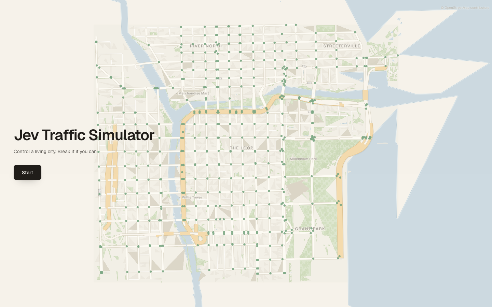

Landing, initial load — The product shell preserved from the baseline, now sitting over real Chicago geography.

### 01 · loop

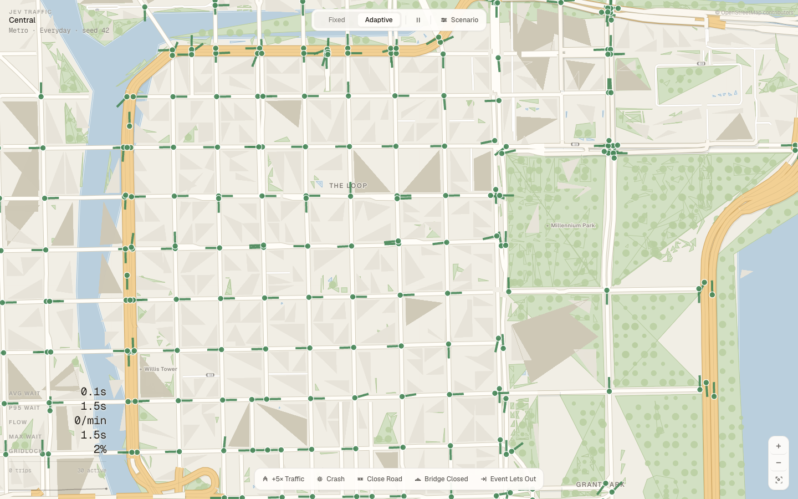

The Loop, mid zoom — Real downtown block structure and street fabric: irregular blocks, alleys, one-way pairs, the river cutting through.

### 02 · river

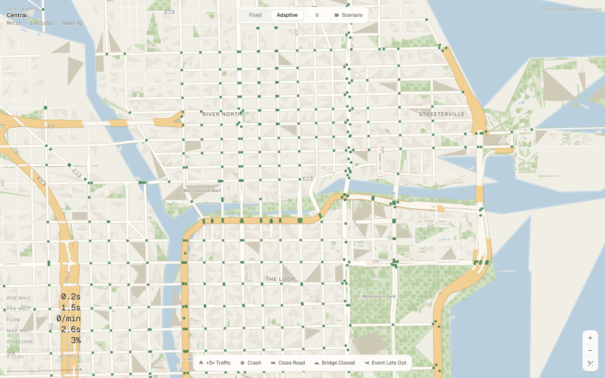

Chicago River, both branches — The river as extracted geometry (75 water polygons after MultiPolygon explosion) with the real bridge inventory crossing it.

### 03 · interchange

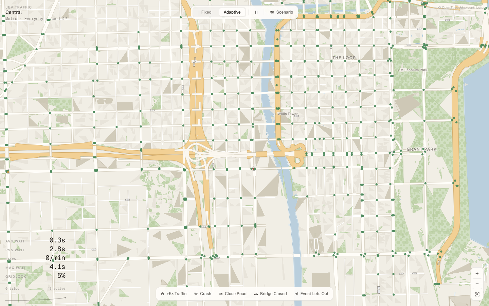

I-90/94 / I-290 interchange — Grade-separated expressway geometry with real ramps and merges, not authored circles.

### 04 · metro

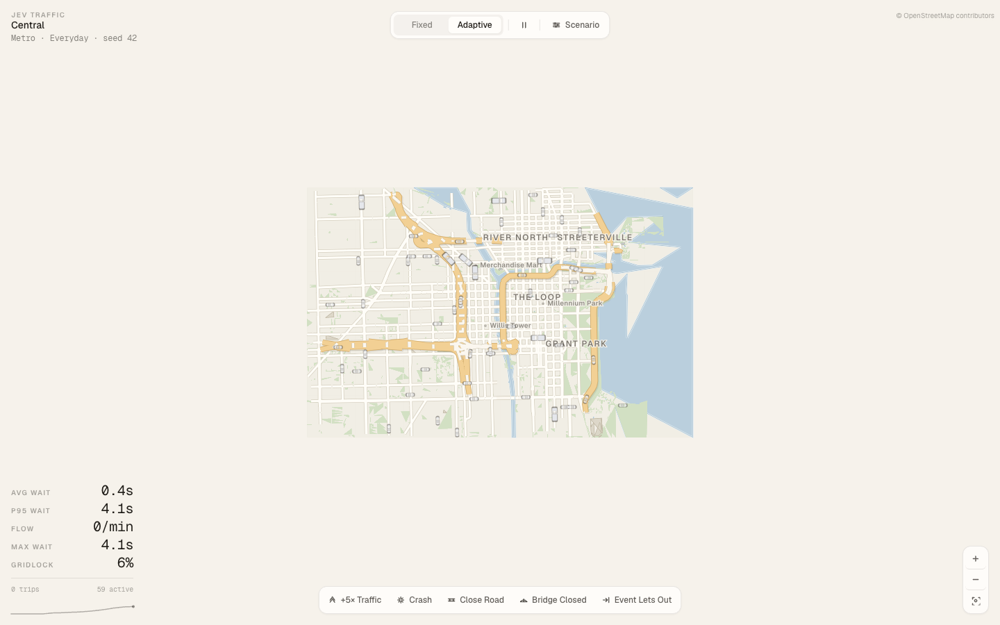

Full Metro extent — The frozen master extent: 2 352 intersections / 5 131 directed roads, lakefront on the east edge.

### 05 · stadium

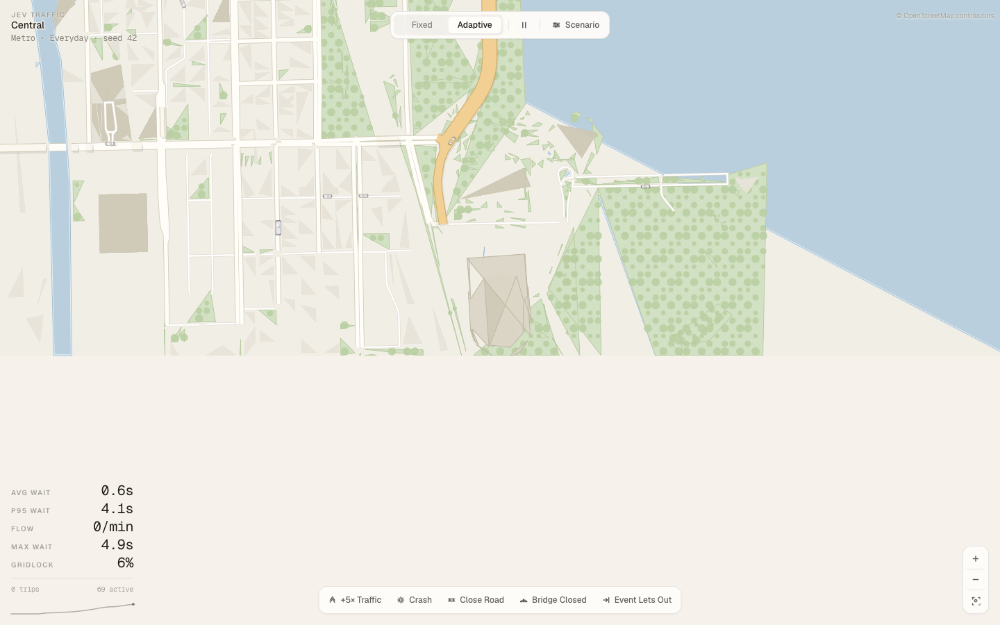

Soldier Field / Museum Campus — Real venue and landmark geometry, used later by the EVENT LETS OUT incident.

## Phase 2 — make Chicago traffic physically legible

*commit `1459d65` · captured 2026-09-18 · Traffic presentation, map fidelity, physical believability (data bugs fixed first)*

Captured from a production build in Brave at 1440x900. One physical model (render/road-presentation.ts) now owns lane width, road width, lane centres and vehicle size, so the renderer cannot drift from the data. Zoom grammar: far zoom carries road-level congestion instead of glyphs, close zoom carries approach signals, stop bars, queues and vehicle classes.

| # | shot | view | what it shows |
| - | ---- | ---- | ------------- |
| 01 | [metro-far](phase-2/01-metro-far.png) | Full Metro, steady demand, z12.0 | Chicago reads as a living traffic system: road hierarchy, river, parks and labels, no signal glyphs and no debug overlays at this zoom. |
| 02 | [loop-mid](phase-2/02-loop-mid.png) | The Loop, mid zoom | Neighborhood zoom: flow and congestion readable, bridges and ramps visible, signals still secondary. |
| 03 | [loop-close](phase-2/03-loop-close.png) | The Loop, street zoom, z16.4 | Vehicles sit inside their own carriageway, road widths follow real lane counts, stop bars and approach signal heads are visible, real street names are placed along the roads. |
| 04 | [river-bridges](phase-2/04-river-bridges.png) | Chicago River, z15.4 | Bridge hierarchy survives road class: a motorway bridge keeps motorway weight, a downtown river bridge does not read as an expressway. |
| 05 | [interchange](phase-2/05-interchange.png) | I-90/94 / I-290, z15.0 | Grade separation reads clearly: separate carriageways stay separate, ramps are narrower, merge and diverge geometry stays visible, and no traffic signals appear on expressway mainline. |
| 06 | [queue](phase-2/06-queue.png) | Michigan & Wacker area, z17.0 | Queue packing: queued vehicles rank from the stop line backwards with class-specific lengths, so no two vehicles occupy the same space at a signal. |
| 07 | [vehicle-classes](phase-2/07-vehicle-classes.png) | Downtown, z17.6 | Vehicle classes stay readable at street zoom: cars, trucks and bicycles differ in length and weight and each fits inside the road casing. |
| 08 | [congestion-far](phase-2/08-congestion-far.png) | Full Metro, rush demand, z12.4 | Congestion overlay: only roads under real pressure light up (amber, orange, red); the rest of the grid stays neutral instead of being recolored. |
| 09 | [bridge-closed](phase-2/09-bridge-closed.png) | River crossing under BRIDGE CLOSED, z15.6 | The closure bands the whole logical water crossing, not one OSM fragment, with a single named plate and traffic visibly rerouting off the approach. |
| 10 | [event-venue](phase-2/10-event-venue.png) | United Center under EVENT LETS OUT, z15.2 | Event release anchored to the real venue with a restrained pulse and egress traffic emerging from the surrounding streets — no purple magic circle. |
| 11 | [roundabout-area](phase-2/11-roundabout-area.png) | Roundabout area, z13.2 | Roundabout rings stay clean: no signal glyphs and no axis bars drawn across a circular junction. |
| 12 | [oneway](phase-2/12-oneway.png) | Wacker one-way pair, z17.2 | One-way carriageways keep their own centreline while the opposing direction of a paired street sits on its own, so directional lanes read correctly. |

### 01 · metro-far

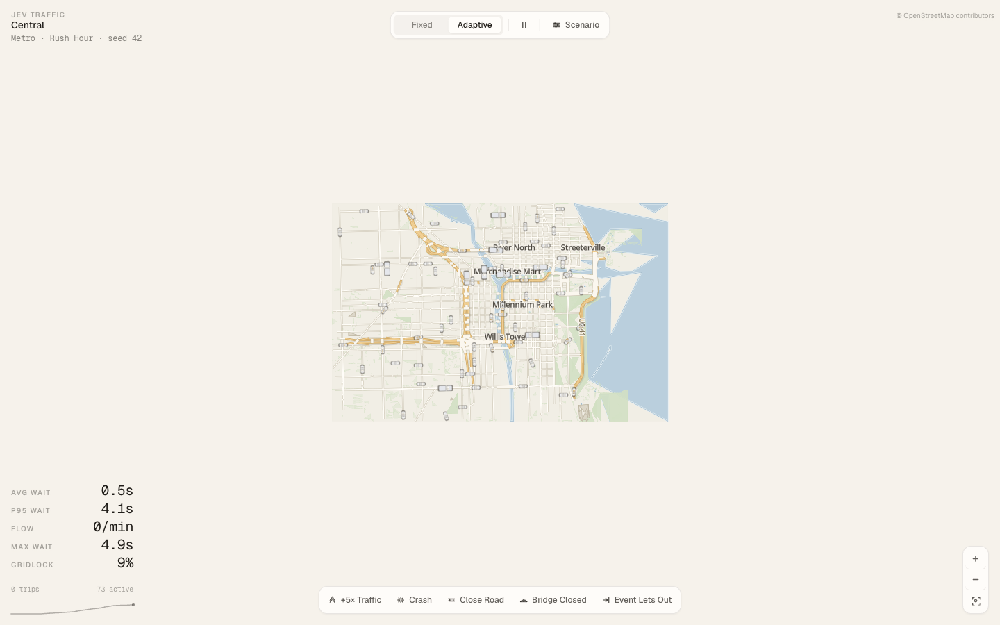

Full Metro, steady demand, z12.0 — Chicago reads as a living traffic system: road hierarchy, river, parks and labels, no signal glyphs and no debug overlays at this zoom.

### 02 · loop-mid

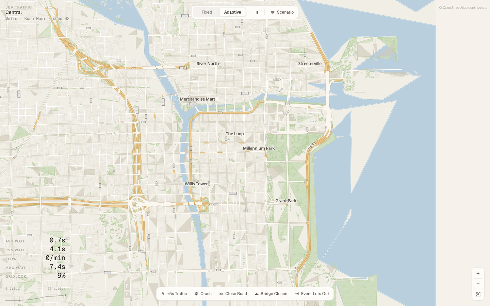

The Loop, mid zoom — Neighborhood zoom: flow and congestion readable, bridges and ramps visible, signals still secondary.

### 03 · loop-close

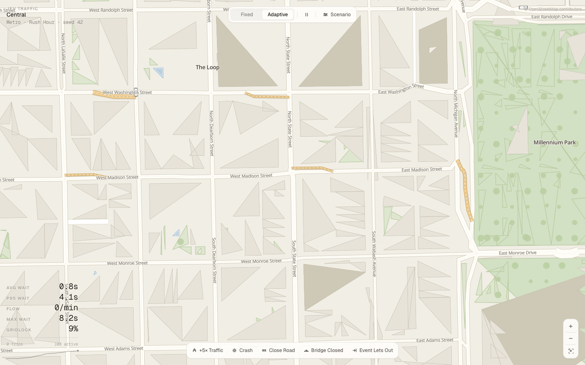

The Loop, street zoom, z16.4 — Vehicles sit inside their own carriageway, road widths follow real lane counts, stop bars and approach signal heads are visible, real street names are placed along the roads.

### 04 · river-bridges

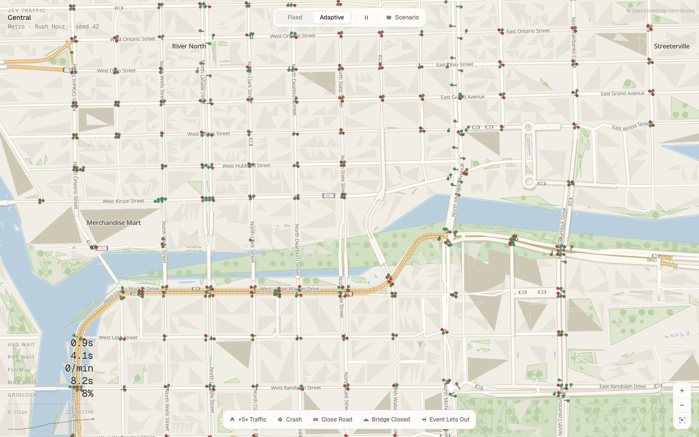

Chicago River, z15.4 — Bridge hierarchy survives road class: a motorway bridge keeps motorway weight, a downtown river bridge does not read as an expressway.

### 05 · interchange

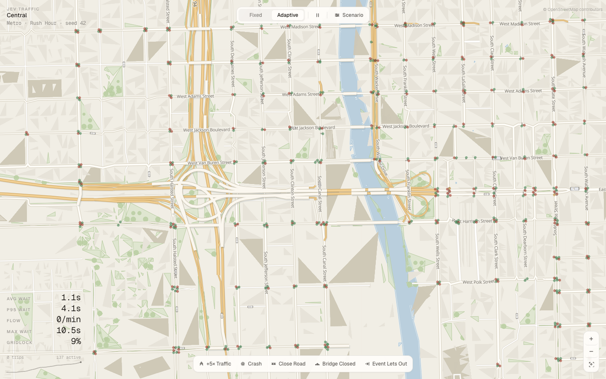

I-90/94 / I-290, z15.0 — Grade separation reads clearly: separate carriageways stay separate, ramps are narrower, merge and diverge geometry stays visible, and no traffic signals appear on expressway mainline.

### 06 · queue

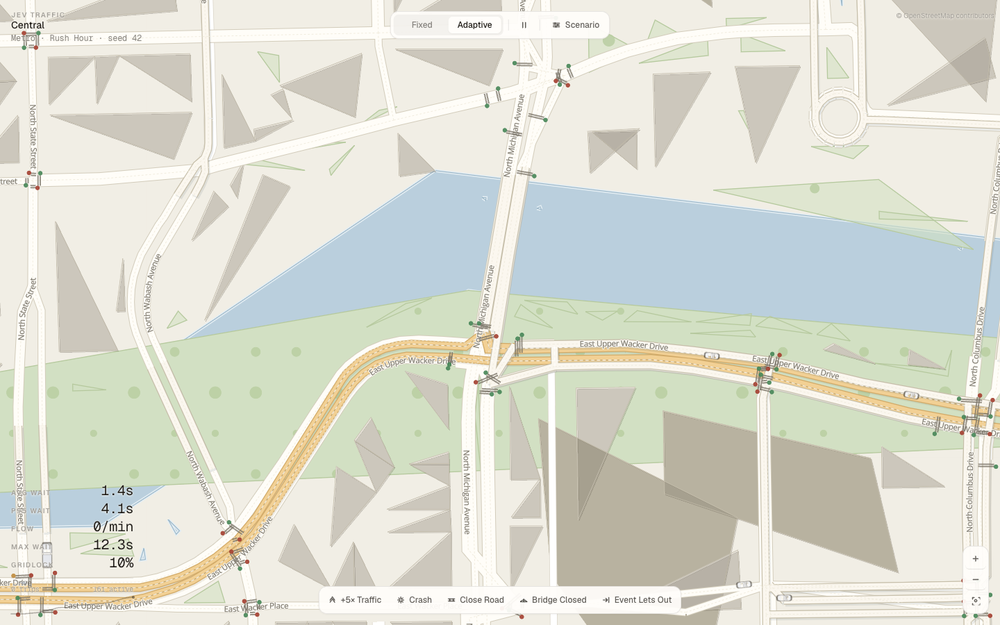

Michigan & Wacker area, z17.0 — Queue packing: queued vehicles rank from the stop line backwards with class-specific lengths, so no two vehicles occupy the same space at a signal.

### 07 · vehicle-classes

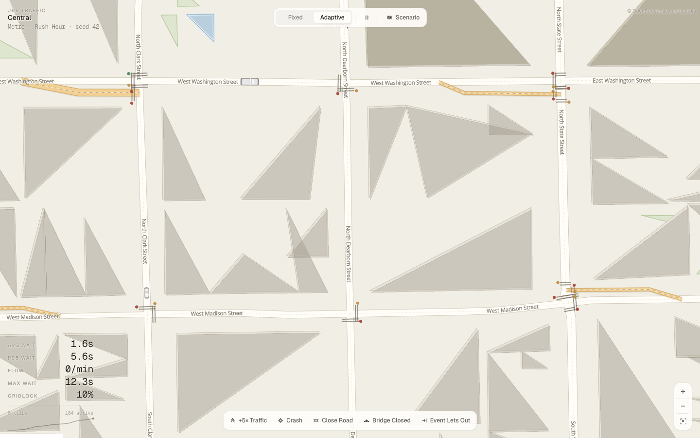

Downtown, z17.6 — Vehicle classes stay readable at street zoom: cars, trucks and bicycles differ in length and weight and each fits inside the road casing.

### 08 · congestion-far

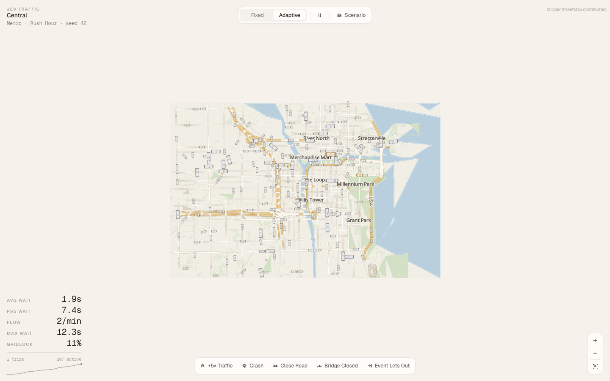

Full Metro, rush demand, z12.4 — Congestion overlay: only roads under real pressure light up (amber, orange, red); the rest of the grid stays neutral instead of being recolored.

### 09 · bridge-closed

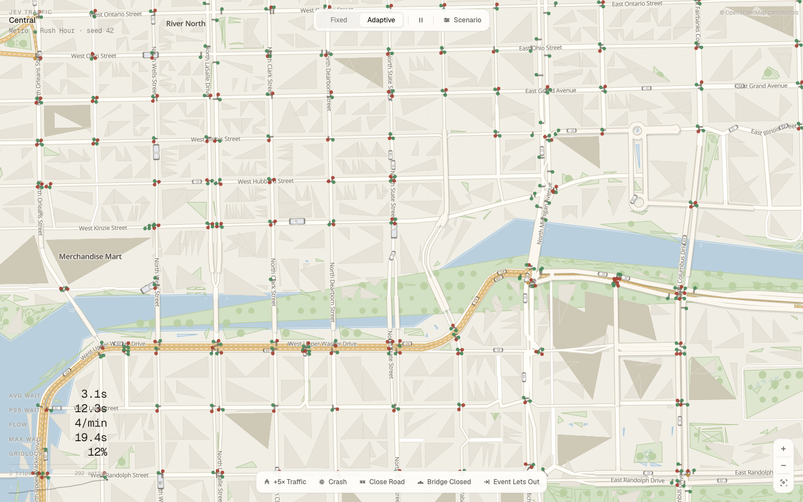

River crossing under BRIDGE CLOSED, z15.6 — The closure bands the whole logical water crossing, not one OSM fragment, with a single named plate and traffic visibly rerouting off the approach.

### 10 · event-venue

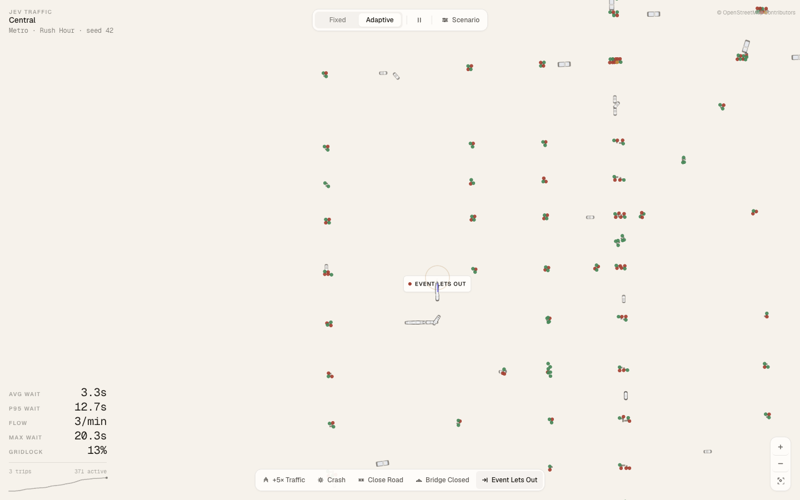

United Center under EVENT LETS OUT, z15.2 — Event release anchored to the real venue with a restrained pulse and egress traffic emerging from the surrounding streets — no purple magic circle.

### 11 · roundabout-area

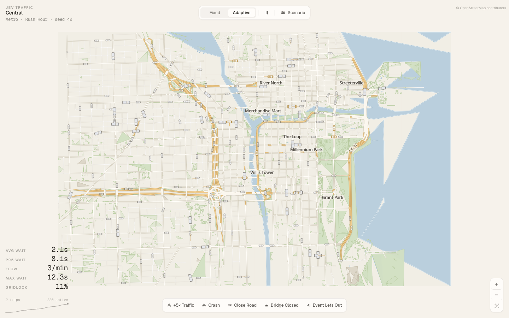

Roundabout area, z13.2 — Roundabout rings stay clean: no signal glyphs and no axis bars drawn across a circular junction.

### 12 · oneway

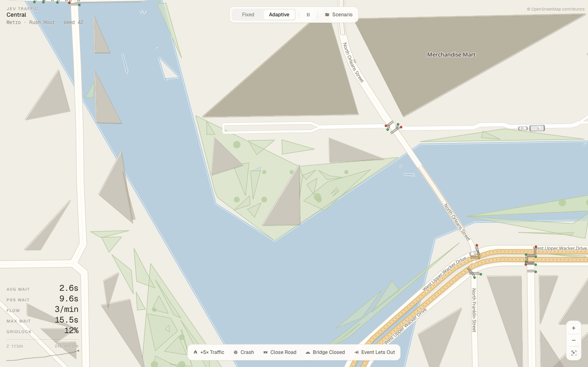

Wacker one-way pair, z17.2 — One-way carriageways keep their own centreline while the opposing direction of a paired street sits on its own, so directional lanes read correctly.
